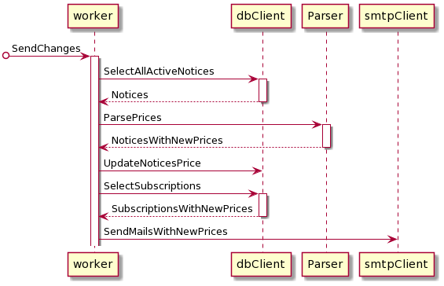

Sequence диаграмма процесса подписки.

Диаграмма описывает процесс, который начинается, когда пользователь подписывается на объявление.
Сначала происходит проверка того, что переданный почтовый адрес подтверждён.
Если пользователь не подтвердил свою почту или ни разу не пробовал подписаться на объявление, то ему на почту придет письмо с просьбой перейти по ссылке для подтверждения подписки.
Дальше переданная ссылка на объявление сохраняется в БД (если ранее такой уже сохранено не было) и связывается с переданным почтовым ящиком. 

Sequence диаграмма процесса отправки писем с обновленными объявлениями.

Диаграмма описывает процесс, который начинается с некоторой заданной периодичностью.
Сначала из БД считываются все объявления, на которые кто-то подписан (пользователи с неподтвержденными адресами почты не считаются)
Дальше происходит парсинг объявлений и сравнение новых цен со старыми. Если никаких изменений нет, то объявление отбрасывается.
Сохраняем в БД обновлённые цены.
Отправляем на почтовые адреса информацию о измененных объявлениях. 

Диаграмма классов

